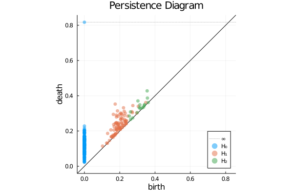
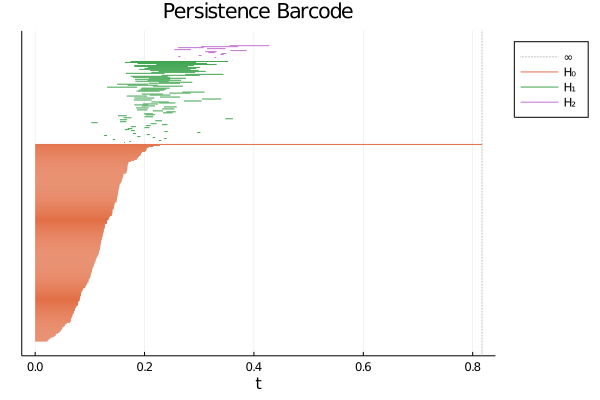

<div align="center">
  

_Flexible and efficient persistent homology computation._

[](https://coveralls.io/github/mtsch/Ripserer.jl?branch=master)
[](https://github.com/mtsch/Ripserer.jl/actions?query=workflow%3ATest)
[](https://mtsch.github.io/Ripserer.jl/dev)
[](https://joss.theoj.org/papers/0c8b6abead759ba068ee178fedc998a9)

</div>

## Introduction

Ripserer is a pure Julia implementation of the [Ripser](https://github.com/Ripser/ripser)
algorithm for computing persistent homology. Its aims are to be easy to use, generic, and
fast.

See the [documentation](https://mtsch.github.io/Ripserer.jl/dev) for more information and
usage examples.

If you're looking for persistence diagram-related functionality such as Wasserstein or
bottleneck distances, persistence images, or persistence curves, please see
[PersistenceDiagrams.jl](https://github.com/mtsch/PersistenceDiagrams.jl).

## Quick start

This package is registered. To install it, run the following.

```julia
julia> using Pkg
julia> Pkg.add("Ripserer")
```

Now, generate some data.

```julia
julia> data = [(rand(), rand(), rand()) for _ in 1:200]
```

The main exported function in this package is
[`ripserer`](https://mtsch.github.io/Ripserer.jl/dev/api/ripserer/#Ripserer.ripserer). By
default, it computes Vietoris-Rips persistent homology on point cloud data and distance
matrices.

```julia
julia> ripserer(data)
# 2-element Vector{PersistenceDiagrams.PersistenceDiagram}:
#  200-element 0-dimensional PersistenceDiagram
#  84-element 1-dimensional PersistenceDiagram
```

[Several other filtration
types](https://mtsch.github.io/Ripserer.jl/dev/api/ripserer/#Filtrations) are supported. We
tell `ripserer` to use them by passing them as the first argument.

```julia
julia> ripserer(EdgeCollapsedRips, data)
# 2-element Vector{PersistenceDiagrams.PersistenceDiagram}:
#  200-element 0-dimensional PersistenceDiagram
#  84-element 1-dimensional PersistenceDiagram
```

Sometimes you may want to initialize a filtration in advance.

```julia
julia> rips = EdgeCollapsedRips(data, threshold=1)
# EdgeCollapsedRips{Int64, Float64}(nv=200)
```
```julia
julia> ripserer(rips, dim_max=2)
# 3-element Vector{PersistenceDiagrams.PersistenceDiagram}:
#  200-element 0-dimensional PersistenceDiagram
#  84-element 1-dimensional PersistenceDiagram
#  16-element 2-dimensional PersistenceDiagram
```

Ripserer supports plotting with
[Plots.jl](https://github.com/JuliaPlots/Plots.jl). Experimental
[Makie.jl](https://github.com/JuliaPlots/Makie.jl) support is also available
[here](https://github.com/mtsch/MakieRipserer.jl).

Plotting persistence diagrams and barcodes is straightforward:

```julia
using Plots
result = ripserer(data, dim_max=2)
plot(plot(result), barcode(result)
```


```julia
barcode(result)
```

