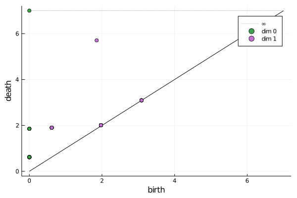
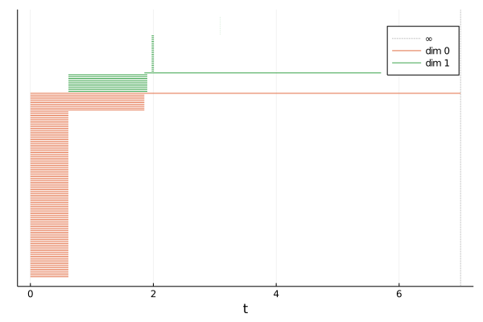
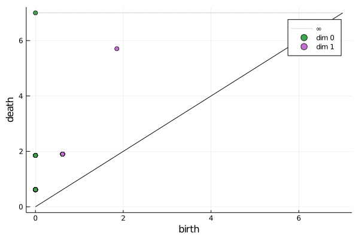
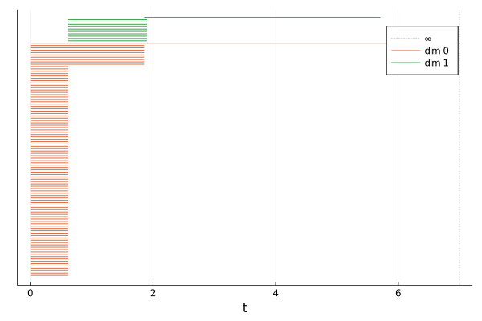

# Ripserer.jl

_Efficient computation of persistent homology._

[](https://coveralls.io/github/mtsch/Ripserer.jl?branch=master)
[](https://travis-ci.org/mtsch/Ripserer.jl)
[](https://mtsch.github.io/Ripserer.jl/dev)

Ripserer is a pure Julia implementation of the [ripser](https://github.com/Ripser/ripser)
algorithm for persistent homology.

## Quick Start

This package is still under development and is currently unregistered. To install it, run
the following.

```julia
julia> using Pkg
julia> Pkg.add("https://github.com/mtsch/Ripserer.jl")
```

Generate 100 points sampled from a torus.

```julia
julia> n = 10
julia> r = 1
julia> R = 4
julia> torus = [((R + r*cos(θ))*cos(φ), (R + r*cos(θ))*sin(φ), r*sin(θ))
                for θ in range(0, 2π, length=n+1)[1:end-1]
                for φ in range(0, 2π, length=n+1)[1:end-1]]
100-element Array{Tuple{Float64,Float64,Float64},1}:
 (5.0, 0.0, 0.0)
 (4.045084971874737, 2.938926261462366, 0.0)
 (1.5450849718747373, 4.755282581475767, 0.0)
 (-1.5450849718747368, 4.755282581475768, 0.0)
 (-4.045084971874736, 2.9389262614623664, 0.0)
 (-5.0, 6.123233995736766e-16, 0.0)
 ⋮
 (-3.890576474687263, 2.82666926731747, -0.5877852522924734)
 (-4.8090169943749475, 5.889347269206504e-16, -0.5877852522924734)
 (-3.8905764746872635, -2.826669267317469, -0.5877852522924734)
 (-1.4860679774997905, -4.573646949474427, -0.5877852522924734)
 (1.4860679774997887, -4.573646949474428, -0.5877852522924734)
 (3.890576474687263, -2.8266692673174703, -0.5877852522924734)
```

Run Ripserer.

```julia
julia> using Ripserer
julia> result = ripserer(torus)
2-element Array{PersistenceDiagram{PersistenceInterval{Float64,Nothing}},1}:
 100-element 0-dimensional PersistenceDiagram
 41-element 1-dimensional PersistenceDiagram
```

Plot the result as a persistence diagram or barcode.

```julia
julia> using Plots; gr()
julia> plot(result)
julia> barcode(result)
```




We notice some noise around the diagonal. This can be mitigated by running Ripserer with
`ripserer(torus, ratio=2)` or by simply filtering the diagram.

```julia
julia> result[2] = filter(x -> death(x) > 2birth(x), result[2])
11-element 1-dimensional PersistenceDiagram:
 [0.6180339887498962, 1.9021130325903048)
 [0.6180339887498962, 1.9021130325903057)
 [0.6180339887498962, 1.9021130325903057)
 [0.6180339887498962, 1.9021130325903057)
 [0.6180339887498962, 1.9021130325903066)
 [0.6180339887498962, 1.9021130325903066)
 [0.6180339887498962, 1.9021130325903066)
 [0.6180339887498962, 1.9021130325903066)
 [0.6180339887498991, 1.9021130325903057)
 [0.618033988749902, 1.9021130325903057)
 [1.854101966249685, 5.706339097770921)
julia> plot(result)
julia> barcode(result)
```



